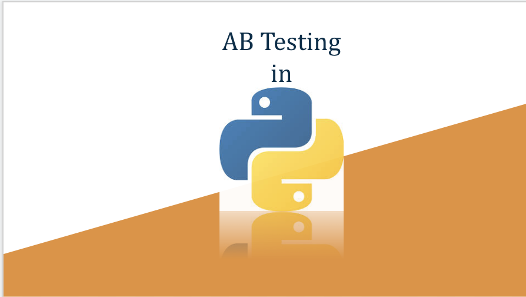

# AB Testing in Python


A PyBay 2019 talk
by Raul Maldonado

## Overview

This repository is designated for my PyBay 2019 talk on an (frequentist) approach to A/B Testing, in Python.

Enjoy! :D
______

A/B Testing is "[a randomized experiment of two variants, A and B.](https://en.wikipedia.org/wiki/A/B_testing)” This test quantitatively compares two variants/samples with a single "metric of choice" in evaluation if there exists a statistical significance between said groups.


For example, let's say we ran a digital ad campaign A, with a Call to Action caption 'Click here, please!' 

Also, let's say we have an alternative ad campaign B with slight modification from A, being the change in the Call to Action to "Learn more here!". 

This in mind, our goal is to decide to see if there is a difference in the campaign's Click Through Rate (CTR) performance such that we increase our engagement.

> We define $\text{CTR} := \tfrac{\text{Total Number of Successes}}{\text{Total Number of Events}}$

That is, Considering two ad Campaigns A & B, each with it's unique distinction, we want to evaluate if there is a difference, a statistical difference in fact, in CTR performance.


## Resources

* [Code](Code/ABTesting-Presentation-2019.ipynb)

* [Technical Requirements](Resources/technicalRequirements/environment.yaml)
    * ```conda env create -f environment.yaml```
    * Yes, this is conda dependent :/

* [Slides](https://docs.google.com/presentation/d/1nr8O-hS070yhBZoc5KtMQgEdremG0-oZP0ujUnocELc/edit?usp=sharing)